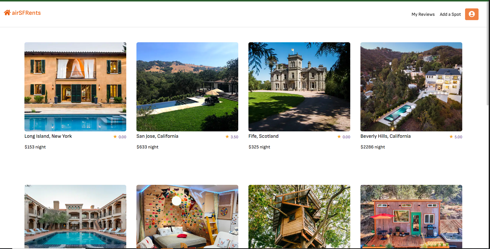
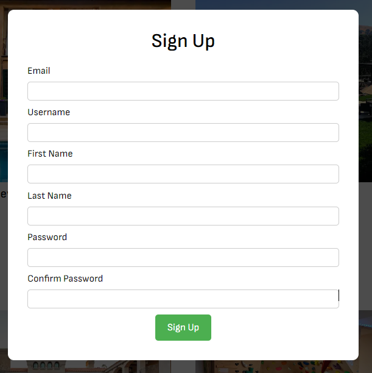
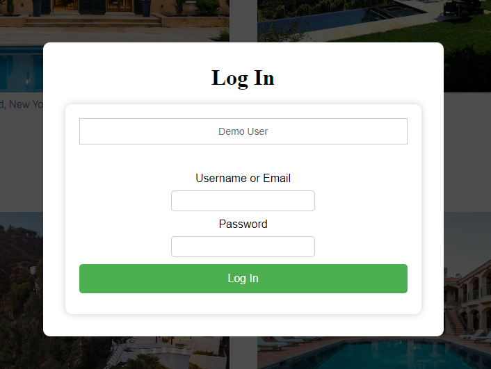
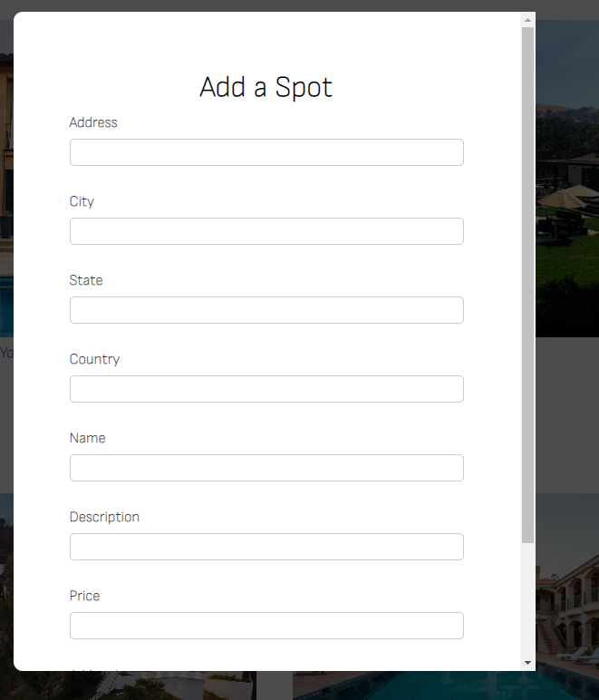
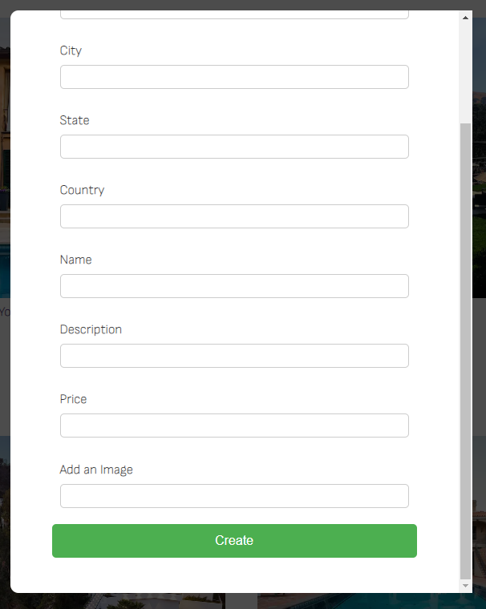
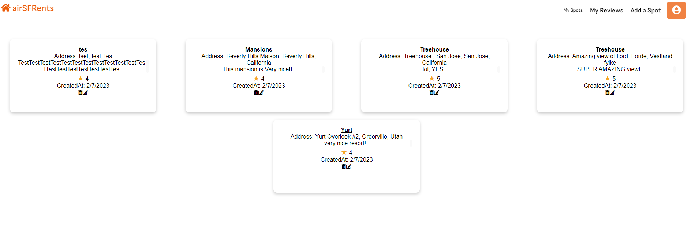

# About AirSfRentals:
- AirSfRentals is an online vacation rental platform inspired by AirBnB. This platform allows users to sign up, login, and create, edit, and delete vacation rental listings, as well as create and delete reviews. The live link to the website is: https://sam-airsf.onrender.com.

- The logo that I have depicts a small rental house which is inspired from the AirBnB logo which is also centered around vacation rentals. The website currently has several unique features. One of the features  includes the ability for users to add reviews that are displayed as review card boxes. The website also allows users to easily delete their own reviews by clicking the trash can icon.

## Technologies used:
    - Sequelize
    - Javascript
    - React
    - Redux
    - Express
    - NodeJS
    - HTML5 / CSS
    - Database: PostgreSQL
    - Hosting: Render

## Demo user:
- A demo user is available in the login dropdown menu without the need to sign up. Simply click on the "Demo User" button and it will log you in as the Demo User.


## Features
* A user-friendly interface with a custom logo representing an apartment house.
* The ability to add reviews which will appear as review cards on the website.
* A demo user option to test the platform without having to sign up.
* User authentication allowing new users to sign up with a username, email address, and password.
* Existing users can log into their account to check their listings, create reviews, edit listings, and delete listings.
* Listings include information such as the address, price, city, state, country, etc.
* The ability to see all reviews created by a user in one place.

# Setup locally on machine
Follow these steps to set up AirSfRentals on your local machine:

1. Download and install Ubuntu 20.04 terminal: https://www.microsoft.com/store/productId/9MTTCL66CPXJ

2. Clone the repository from GitHub: ```git clone git@github.com:sfazli96/API-project.git```

3. Change directory into the cloned repository: ```cd API-project```

4. Install packages for both the frontend and backend:
    * ```npm install``` in the ```backend``` directory
    * ```npm install``` in the ```frontend``` directory

5. Start the server for both the frontend and backend:
    * ```npm start``` in the ```backend``` directory
    * ```npm start``` in the ```frontend``` directory
    * Note: if ```npm start``` does not work in the backend folder, try running the command ```npm run start:development``` in the backend folder and in the frontend folder as well if the problem persists with npm start not working.
6. Open your browser and type in https://localhost:3000/ and you should see the website.

# Pages

## Home Page
- Access the login and sign up modal from the top right corner.



## Sign up Modal
- Fill in the required information such as email, username, first and last name, and password to sign up.



## Login Modal
- Log in as an existing user or as a demo user.



## Create Spot listing Modal
- Fill in the required information to create a new spot listing, including a valid image link.



## Listing Page
- View the listing page with information such as the address, price, city, state, country, etc.


## Review Comments and Card
- View, Create and rate a review for a specific place from 1 to 5 stars. You can also delete your review(s).


## My Reviews Page
- See all the reviews you have created and delete them if you chose too. Additionally, you can edit your reviews as well, if you chose to.



## User Authentication
- New users can sign up with a username, email address, and password.
- Existing users can log into their account to check their listings, create reviews, edit listings, and delete listings.
- Users can log out of their account at any time they want.

## Future Plans

In the future, I plan to add CRUD functionality for bookings.
